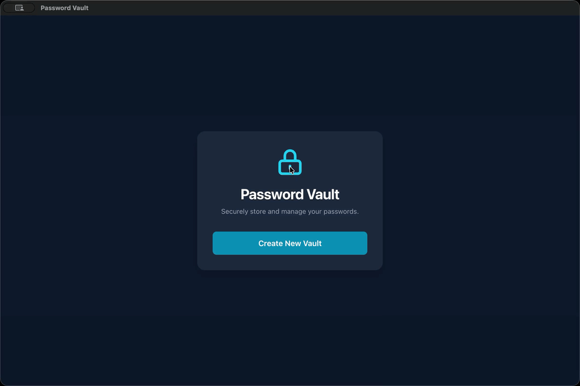

# Password Vault

A secure, completely client-side, local desktop password manager.



---

## 📖 Overview

**Password Vault** is a lightweight, cross-platform desktop application designed to keep your digital credentials safe. Engineered with a zero-knowledge architecture, it ensures that your sensitive data never leaves your device. 

By packaging a modern React web application inside an Electron environment, this project demonstrates a seamless bridge between modern web development and native desktop experiences.

---

## ✨ Key Features

* **Zero-Network Architecture:** All credentials are encrypted and stored locally on your machine using `localStorage`, ensuring absolute privacy.
* **Master Lock Authentication:** A single, secure master password gates access to your entire vault.
* **On-the-Fly Password Generation:** A built-in utility to instantly generate strong, randomized 16-character passwords for new accounts.
* **Quick Actions:** One-click clipboard copying and secure visibility toggles for rapid, safe credential retrieval.
* **Desktop Application:** Compiled as a native macOS application (cross-platform compilation ready via Electron config).

---

## 🔐 Security Architecture

This application employs industry-standard cryptographic protocols to ensure user data is mathematically secure:

* **Key Derivation:** The master password is never stored. Instead, it is salted and hashed using **Argon2id** (configured with robust time and memory costs) to derive a 256-bit encryption key.
* **Data Encryption:** All vault data is encrypted using Node's native `crypto` module with **AES-256-GCM**, providing both confidentiality and authenticated integrity checks.
* **Context Isolation:** Cryptographic operations are handled securely in the Electron main process via strict IPC bridges (using `contextBridge`), keeping Node.js contexts completely isolated from the React renderer.

---

## 🛠️ Tech Stack

This application is built with modern, high-performance web and desktop technologies:

* **Frontend Engine:** React
* **Language:** TypeScript
* **Styling:** Tailwind CSS
* **Build Tooling:** Vite
* **Desktop Wrapper:** Electron
* **Application Packager:** Electron Builder
* **Cryptography:** Argon2 & Node.js Native Crypto

---

## 🚀 Getting Started

Follow these instructions to run the application in your local development environment.

### Prerequisites
* Node.js (v18 or higher recommended)
* npm, yarn, or pnpm

### Installation

1. **Clone the repository:**
   ```
   git clone <your-repository-url>
   cd password-vault
   ```
2. **Install dependencies::**
	```
	npm install
	```
3. **Start the development server for live view:**
	```
	npm run electron:dev
	```
4. **Build for production:**
	```
	npm run electron:build
	```
	
	